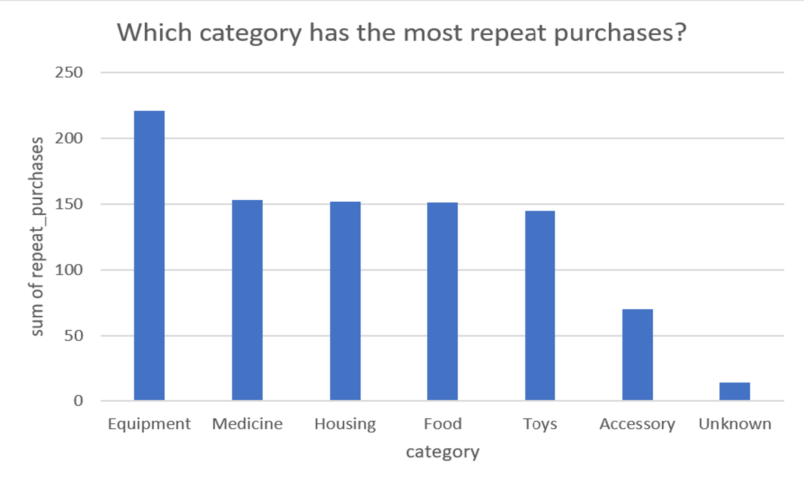
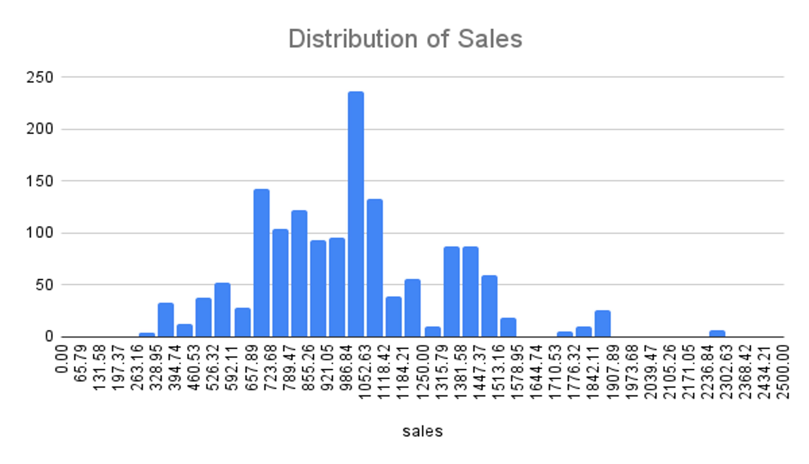

# PetMind - A Retailer of Product for Pets.

-----
## Introduction
------
PetMind is a retailer of products for pets. They are based in the United States. PetMind sells products that are a mix of luxury items and everyday items. Luxury items include toys. Everyday items include food. The company wants to increase sales by selling more everyday products repeatedly. They have been testing this approach for the last year. They now want a report on how repeat purchases impact sales.

## TOOLS USED FOR THE ANALYSIS
------
MS Excel

## DATA VALIDATION & CLEANING
------
The dataset contains 1500 rows and 8 columns. No duplicates were found. Here are the changes I made to the columns in the dataset:

- The “product_id” column has 1500 unique ids.
- The “category” column has a norminal data type and contains with the category of the product, one of 6 values (Housing, Food, Toys, Equipment, Medicine, Accessory). 25 cells were found to contain missing values. They were all replaced with “Unknown”.
- The “animal” contains nominal data. The type of animal the product is for. One of Dog, Cat, Fish, Bird. No missing values were found.
- The “size” column has an ordinal data type and contains size of animal the product is for. Small, Medium, Large. I noticed irregular letter cases in the column. So, a new column was created to clean the cases. I used this formula `=PROPER(D2:D1501)` to change the case.
- The “price” coumn has a continuous data type and contains price the product is sold at. It contains 150 missing values. They were all replaced by the MEDIAN of the price. I used this formula `=MEDIAN(E2:E1501)` and I got 28.065. I also reduced the decimal places to 2.
- The “sales” column has a continuous data type and contains value of all sales of the product in the last year. I rounded the values to 2 decimal places. I found no missing values.
- The “rating” column has a discrete data type and contains customer rating of the product from 1 to 10. 150 missing values were found and they were all replaced with 0.

## DATA ANALYSIS
------
### 2. Create a visualization that shows how many products are repeat purchases. Use the visualization to:

### a. State which category of the variable repeat purchases has the most observations

The "Equipment" category has the highest number of repeat purchases, suggesting that customers are satisfied with the quality and usefulness of these products. The "Medicine" category also has a relatively high number of repeat purchases, indicating customer loyalty to PetMind for their pet's medical needs. The "Food" and "Toys" categories have a similar number of repeat purchases, while the "Accessory" category has a lower number.

### b. Explain whether the observations are balanced across categories of thevariable repeat purchases

In the given order of repeat purchases, we can see that the number of observations is not balanced across categories, with "Equipment" having the highest number of repeat purchases at 221 and "Unknown" having the lowest at 14. This indicates that certain categories have a higher frequency of repeat purchases than others.

### 3. Describe the distribution of all of the sales. Your answer must include a visualization that shows the distribution.

Based on the histogram, the distribution appears to be leptokurtic, with a high peak around the 986.84 to 1052.63 sales range. There also seems to be a number of sales that are outliers, with values much higher than the rest of the data. This may indicate that certain products or events had a significant impact on sales during those periods. Further analysis would be needed to determine the cause of the outliers and whether they should be included in future analysis.

